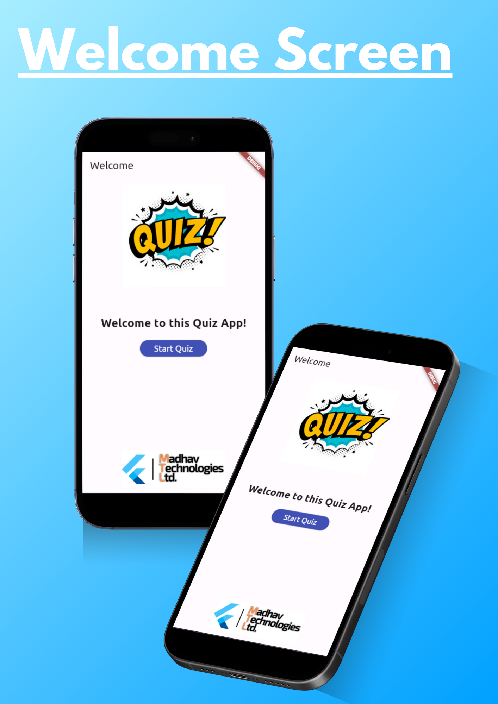
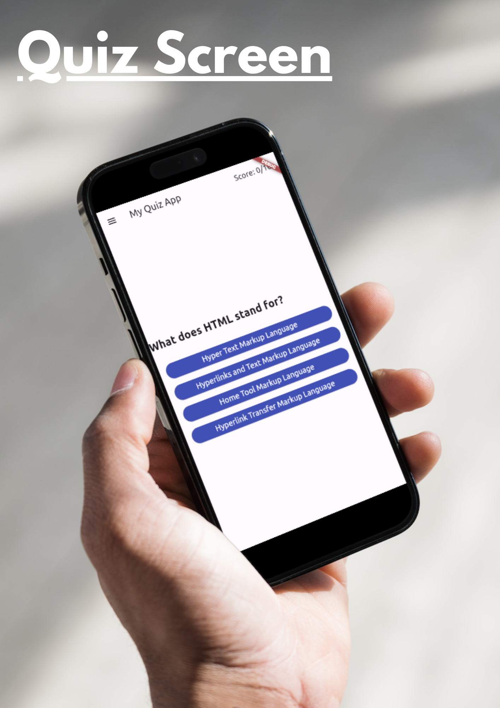
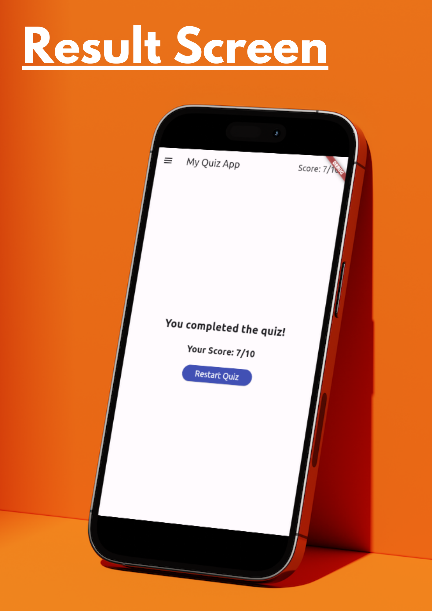
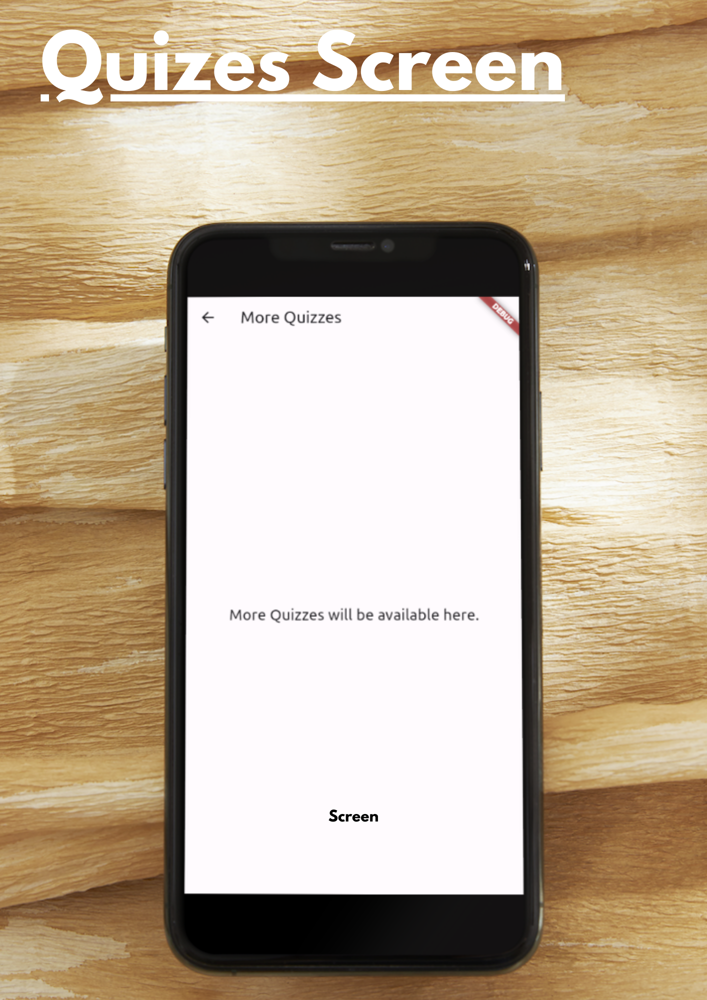
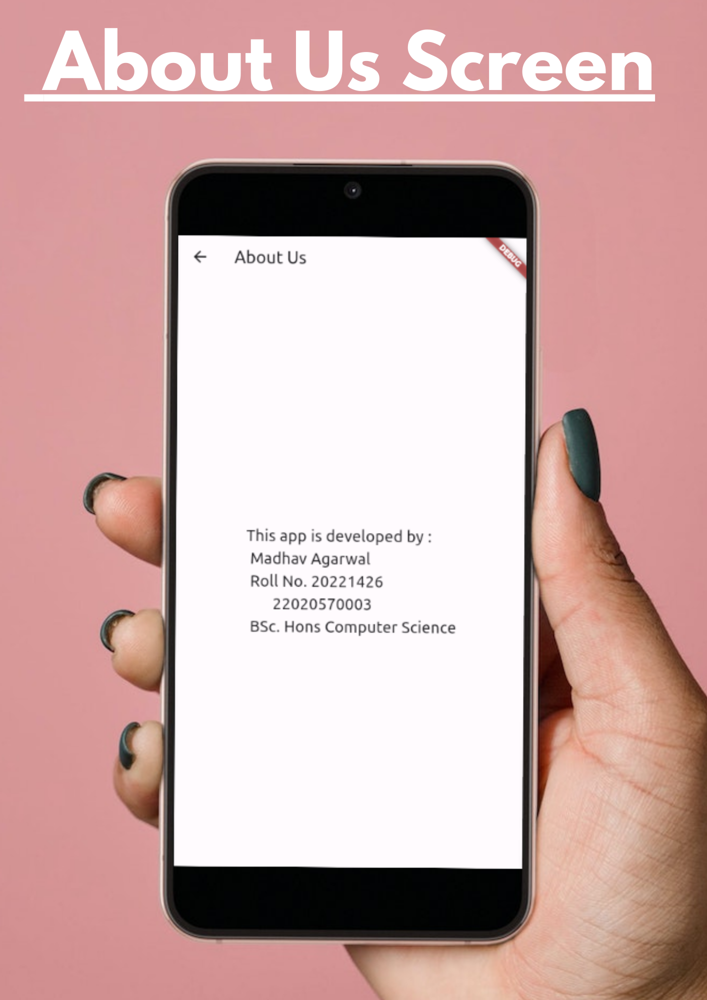

# Quiz App

This project was developed by Madhav Agarwal (Roll No. 20221426) as part of the SEC subject "App Development Using Flutter."

## Overview

The Quiz App is a simple and interactive mobile application built using Flutter, a cross-platform UI toolkit. The app aims to provide users with an engaging quiz experience on various topics related to computer science.

## Features

- **Welcome Screen:** Introduces users to the app and prompts them to start the quiz.
- **Quiz Page:** Displays a series of questions related to computer science topics.
- **Result Screen:** Shows the user's score and allows them to restart the quiz.
- **More Quizzes Section:** A dedicated screen for future expansion with additional quizzes.
- **About Us Screen:** Provides information about the app and its developer.

## Screens

### Welcome Screen

The Welcome Screen displays a welcoming message to users and encourages them to start the quiz. It contains buttons to navigate to the quiz section and other parts of the app.

### Quiz Page

The Quiz Page presents users with a series of questions related to computer science topics. Users can select their answers, and the app tracks their score as they progress through the quiz.

### Result Screen

Once users complete the quiz, the Result Screen appears, showing their total score and providing an option to restart the quiz for another attempt.

### More Quizzes Section

This section will be expanded in the future to include more quizzes on different subjects, providing users with a variety of quiz options.

### About Us Screen

The About Us Screen offers information about the app and its developer, allowing users to learn more about the project and its creators.
